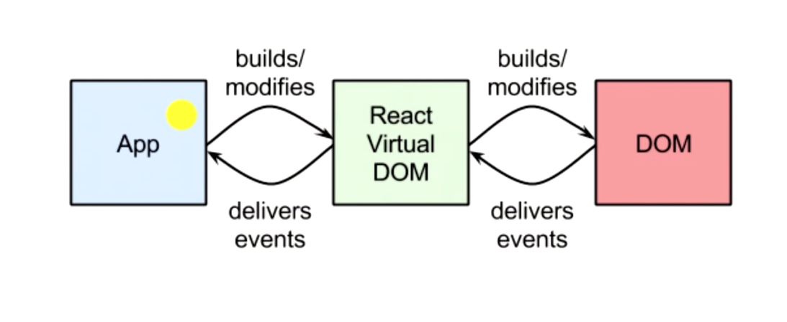

## virtual DOM

   render执行的结果得到的并不是真正的DOM节点，结果仅仅是轻量级的JavaScript对象，我们称之为virtual DOM。具有batching(批处理)和高效的Diff算法。这让我们可以无需担心性能问题而”毫无顾忌”的随时“刷新”整个页面，由虚拟 DOM来确保只对界面上真正变化的部分进行实际的DOM操作

##  virtual DOM  和 原生DOM

原生DOM直接重置 innerHTML。innerHTML 和Virtual DOM 的重绘过程如下：
innerHTML: render html string + 重新创建所有 DOM 元素

Virtual DOM: render Virtual DOM + diff + 必要的 DOM 更新

React.js 相对于直接操作原生DOM有很大的性能优势， 很大程度上都要归功于virtual DOM的batching 和diff。

## batching 和diff

1.传统的diff算法时间复杂度达到o(n3)，而react的diff算法时间复杂度只是o(n)，react的diff能减少到o(n)依靠的是react diff的三大策略。

2.传统的diff算法追求的是“完全”以及“最小”，而react diff则是放弃了这两种追求：
在传统的diff算法下，对比前后两个节点，如果发现节点改变了，会继续去比较节点的子节点，一层一层去对比。就这样循环递归去进行对比，复杂度就达到了o(n3)，n是树的节点数，想象一下如果这棵树有1000个节点，我们得执行上十亿次比较，这种量级的对比次数，时间基本要用秒来做计数单位了。

3.React diff 三大策略:
策略一（tree diff）：Web UI中DOM节点跨层级的移动操作特别少，可以忽略不计。（DOM结构发生改变-----直接卸载并重新creat）
策略二（component diff）：DOM结构一样-----不会卸载,但是会update
策略三（element diff）：所有同一层级的子节点.他们都可以通过key来区分-----同时遵循1.2两点
