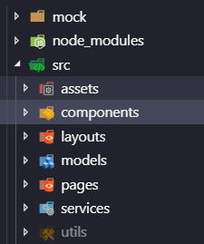
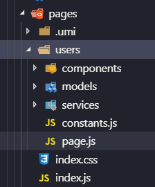

# Dva的项目结构

```
...>dva -v 
//Dva 版本
dva-cli version 1.0.0-beta.4
dva version 2.4.1
    
```




如上图所示 mock 一般用来处理mock数据  、 utils工具包一些常用的工具包   、services服务器请求。layouts 布局 ， components 复用组件， 单个页面开发在 pages中 



一般一个界面就在pages下面 新建一个文件夹(users),pages下文件会自动生成路由。page文件即

[路由](https://umijs.org/zh/guide/router.html#约定式路由)，model 存放reducers 等业务逻辑。 service和后台交互 components 存放组件。

