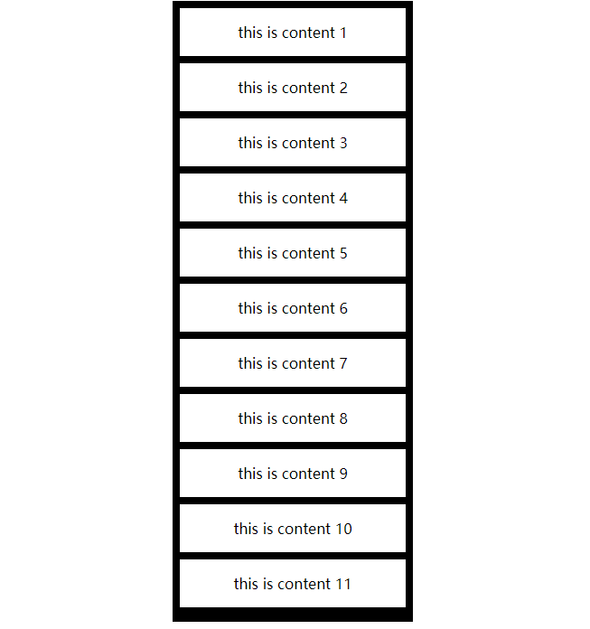
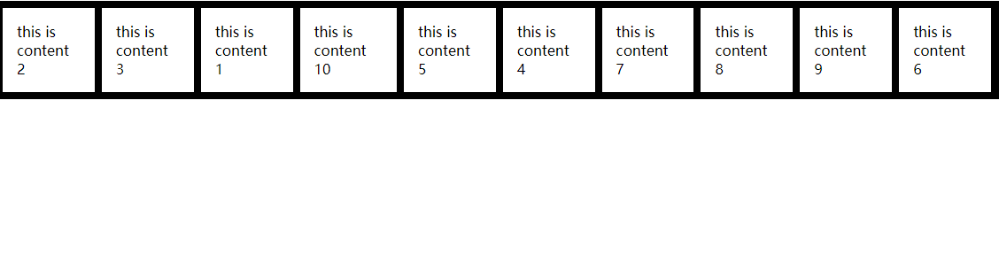

# react-beautiful-dnd  实现组件拖拽

  一个React.js 的 漂亮,可移植性 列表拖拽库。想了解更多react-beautiful-dnd特点适用人群请看 [官方文档](https://github.com/atlassian/react-beautiful-dnd)、  [中文翻译文档](https://github.com/chinanf-boy/react-beautiful-dnd-zh)

## 1.安装

​	在已有react项目中 执行以下命令 so easy。

```
# yarn
yarn add react-beautiful-dnd

# npm
npm install react-beautiful-dnd --save
```

## 2.APi

   详情查看 官方文档。


## 3.react-beautiful-dnd demo

### 3.1 demo1  纵向组件拖拽

效果下图：

实现代码：

```react
import React, { Component } from "react";
import { DragDropContext, Droppable, Draggable } from "react-beautiful-dnd";

//初始化数据
const getItems = count =>
  Array.from({ length: count }, (v, k) => k).map(k => ({
    id: `item-${k + 1}`,
    content: `this is content ${k + 1}`
  }));

// 重新记录数组顺序
const reorder = (list, startIndex, endIndex) => {
  const result = Array.from(list);

  const [removed] = result.splice(startIndex, 1);

  result.splice(endIndex, 0, removed);
  return result;
};

const grid = 8;

// 设置样式
const getItemStyle = (isDragging, draggableStyle) => ({
  // some basic styles to make the items look a bit nicer
  userSelect: "none",
  padding: grid * 2,
  margin: `0 0 ${grid}px 0`,

  // 拖拽的时候背景变化
  background: isDragging ? "lightgreen" : "#ffffff",

  // styles we need to apply on draggables
  ...draggableStyle
});	

const getListStyle = () => ({
  background: 'black',
  padding: grid,
  width: 250
});


export default class ReactBeautifulDnd extends Component {
  constructor(props) {
    super(props);
    this.state = {
      items: getItems(11)
    };
    this.onDragEnd = this.onDragEnd.bind(this);
  }

  onDragEnd(result) {
    if (!result.destination) {
      return;
    }

    const items = reorder(
      this.state.items,
      result.source.index,
      result.destination.index
    );

    this.setState({
      items
    });
  }


  render() {
    return (
      <DragDropContext onDragEnd={this.onDragEnd}>
        <center>
          <Droppable droppableId="droppable">
            {(provided, snapshot) => (
              <div
              //provided.droppableProps应用的相同元素.
                {...provided.droppableProps}
                // 为了使 droppable 能够正常工作必须 绑定到最高可能的DOM节点中provided.innerRef.
                ref={provided.innerRef}
                style={getListStyle(snapshot)}
              >
                {this.state.items.map((item, index) => (
                  <Draggable key={item.id} draggableId={item.id} index={index}>
                    {(provided, snapshot) => (
                      <div
                        ref={provided.innerRef}
                        {...provided.draggableProps}
                        {...provided.dragHandleProps}
                        style={getItemStyle(
                          snapshot.isDragging,
                          provided.draggableProps.style
                        )}
                      >
                        {item.content}
                      </div>
                    )}
                  </Draggable>
                ))}
                {provided.placeholder}
              </div>
            )}
          </Droppable>
        </center>
      </DragDropContext>
    );
  }
}


```

###   3.2 demo2 水平拖拽

​	效果下图：

实现代码： 其实和纵向拖拽差不多 Droppable 中 多添加了一个排列顺序的属性，direction="horizontal"

```react
import React, { Component } from "react";
import { DragDropContext, Droppable, Draggable } from "react-beautiful-dnd";


const getItems = count => (
  Array.from({ length: count }, (v, k) => k).map(k => ({
    id: `item-${k + 1}`,
    content: `this is content ${k + 1}`
  }))
)

// 重新记录数组顺序
const reorder = (list, startIndex, endIndex) => {
  const result = Array.from(list);
  //删除并记录 删除元素
  const [removed] = result.splice(startIndex, 1);
  //将原来的元素添加进数组
  result.splice(endIndex, 0, removed);
  return result;
};

const grid = 8;


// 设置样式
const getItemStyle = (isDragging, draggableStyle) => ({
  // some basic styles to make the items look a bit nicer
  userSelect: "none",
  padding: grid * 2,
  margin: `0 ${grid}px 0 0 `,

  // 拖拽的时候背景变化
  background: isDragging ? "lightgreen" : "#ffffff",

  // styles we need to apply on draggables
  ...draggableStyle
});

const getListStyle = () => ({
  background: 'black',
  display: 'flex',
  padding: grid,
  overflow: 'auto',
});


class ReactBeautifulDndHorizontal extends Component {
  constructor(props) {
    super(props);
    this.state = {
      items: getItems(10)
    };
    this.onDragEnd = this.onDragEnd.bind(this);
  }

  onDragEnd(result) {
    // dropped outside the list
    if (!result.destination) {
      return;
    }

    const items = reorder(
      this.state.items,
      result.source.index,
      result.destination.index
    );

    this.setState({
      items
    });
  }

  render() {
    return (
      <DragDropContext onDragEnd={this.onDragEnd}>
        <Droppable droppableId="droppable" direction="horizontal">
          {(provided, snapshot) => (
            <div
              {...provided.droppableProps}
              ref={provided.innerRef}
              style={getListStyle(snapshot.isDraggingOver)}
            >
              {this.state.items.map((item, index) => (
                <Draggable key={item.id} draggableId={item.id} index={index}>
                  {(provided, snapshot) => (
                    <div
                      ref={provided.innerRef}
                      {...provided.draggableProps}
                      {...provided.dragHandleProps}
                      style={getItemStyle(
                        snapshot.isDragging,
                        provided.draggableProps.style
                      )}
                    >
                      {item.content}
                    </div>
                  )}
                </Draggable>
              ))}
              {provided.placeholder}
            </div>
          )}
        </Droppable>
      </DragDropContext>
    )
  }
}

export default ReactBeautifulDndHorizontal
```

### 3.3   demo3实现一个代办事项的拖拽（纵向 横向拖拽）


实现原理其实大同小异 。代码整理后放在github上。地址：

## 4.感受

 		目前简单的使用react - beautiful-dnd下来感觉  ，上手感觉挺简单，api也不繁琐。性能也不错（demo2中做过渲染170多个task。拖拽起来还是如丝般顺滑）。日后遇到啥不足会mark在一下。